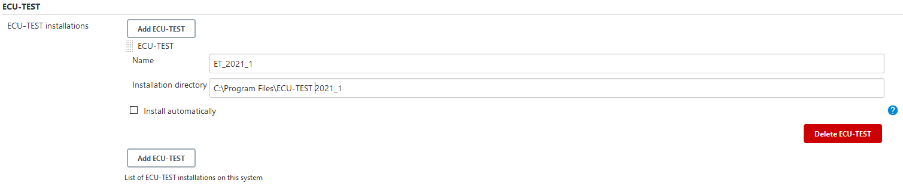

# TraceTronic ECU-TEST-Execution Plugin

[](https://tracetronic.com/products/ecu-test) [](https://github.com/tracetronic/ecu-test-execution-plugin/actions/workflows/gradle.yml)

This plugin enables a platform-independent test execution. Due to the reduced complexity and communication via REST API,
it provides an easy and reliable entry into continuous testing. It integrates 
[ECU-TEST](https://www.tracetronic.com/products/ecu-test) with Jenkins and allows report generation and its upload of 
automated test execution.<br><br>

 

ECU-TEST is a test automation software for the validation of embedded systems in automotive environments developed by
TraceTronic GmbH.<br/>
This software executes regression tests which are essential for validating complex technical products such as electronic
control units (ECUs).<br/>
It supports standardized access to a broad range of test tools and provides automation of distributed test
environments (SiL – MiL – HiL – vehicle).<br><br>


**TraceTronic ECU-TEST Jenkins Plugin** project is part of
the [Automotive DevOps Platform](https://www.tracetronic.com/products/automotive-devops-platform/) by TraceTronic. With
the **Automotive DevOps Platform**, we go from the big picture to the details and unite all phases of vehicle software
testing – from planning the test scopes to summarizing the test results. At the same time, continuous monitoring across
all test phases always provides an overview of all activities – even with several thousand test executions per day and
in different test environments.<br><br>

Please consider other open-source automation solutions by [TraceTronic](https://github.com/tracetronic?type=source),
especially [Jenkins Library](https://github.com/tracetronic/jenkins-library)
and [CX Templates](https://github.com/tracetronic/cx-templates).

## Table of Contents

- [Features](#features)
- [Configuration](#configuration)
    - [ECU-TEST configuration](#ecu-test-configuration)
    - [Pipeline job configuration](#pipeline-job-configuration)
- [Contribution](#contribution)
- [Support](#support)
- [Compatibility](#compatibility)
- [License](#license)

## Features

- Provides an easy integration and control of ECU-TEST with Jenkins
- Enables the execution of ECU-TEST packages and projects with their respective configurations
- Using "pipelines first" approach to improve the automated process and traceability

## Configuration

### ECU-TEST configuration

ECU-TEST installations are administrated in the global tool configuration at section "ECU-TEST". An installation entry
is specified by an arbitrary name and the path to the installation directory. The execution on a Jenkins agent requires
the adaption of the ECU-TEST installation directory on the agent configuration page.



### Pipeline job configuration

The [Pipeline Plugin](https://plugins.jenkins.io/workflow-aggregator) allows to orchestrate automation simple. This
plugin supports the use of all provided build steps from within a Jenkins Pipeline build. The appropriate DSL syntax for
these steps and actions can be easily generated with help of
the [Pipeline Snippet Generator](https://github.com/jenkinsci/pipeline-plugin/blob/master/TUTORIAL.md#exploring-the-snippet-generator)
.

```groovy
node('windows') {
    stage('Start Tools') {
        ttStartTool toolName: 'ECU-TEST', workspaceDir: './workspace', settingsDir: './settings'
    }
    stage('Test Execution') {
        ttRunProject testCasePath: 'sample.prj', testConfig: [tbcPath: 'sample.tbc', tcfPath: 'sample.tcf', constants: [[label: 'sample', value: '123']]]
        ttRunPackage testCasePath: 'sample.pkg', testConfig: [tbcPath: '', tcfPath: '', forceConfigurationReload: true, constants: [[label: 'sample', value: '\'sampleValue\'']]]
    }
    stage('Generate Reports') {
        ttGenerateReports 'HTML'
    }
    stage('Upload Reports') {
        ttUploadReports testGuideUrl: 'http://HOST:Port', authKey: 'ApIAUTheNtiCatIOnKeY0123456789', projectId: 1
    }
    stage('Stop Tools') {
        ttStopTool 'ECU-TEST'
    }
}
```

## Contribution

To report a bug or request an enhancement to this plugin please raise a
new [GitHub issue](https://github.com/tracetronic/ecu-test-plugin/issues/new/choose).

## Support

If you have any further questions, please contact us at [support@tracetronic.com](mailto:support@tracetronic.com).

## Compatibility

- Jenkins LTS 2.235.5 or higher
- Java SE Runtime Environment 8 or higher
- [ECU-TEST](https://www.tracetronic.com/products/ecu-test) 2021.4
- optional: [TEST-GUIDE](https://www.tracetronic.com/products/test-guide) 1.114.3 or higher

## License

This plugin is licensed under the terms of the [3-Clause BSD license](LICENSES/BSD-3-Clause.txt).

Using the [REUSE helper tool](https://github.com/fsfe/reuse-tool), you can run `reuse spdx` to get a bill of materials.