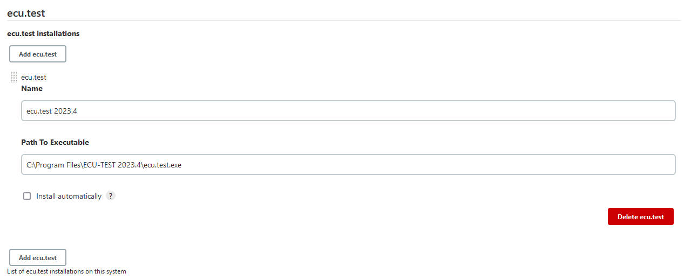

# ecu.test execution plugin

[](https://ci.jenkins.io/job/plugins/job/ecu-test-execution-plugin/job/main) [](https://plugins.jenkins.io/ecu-test-execution) [](https://github.com/jenkinsci/ecu-test-execution-plugin/releases) [](https://plugins.jenkins.io/ecu-test-execution) [](https://github.com/jenkinsci/ecu-test-execution-plugin/blob/main/LICENSE)

This plugin enables a platform-independent test execution. Due to the reduced complexity and communication via REST API,
it provides an easy and reliable entry into continuous testing. It integrates
[ecu.test](https://www.tracetronic.com/products/ecu-test)
and [trace.check](https://www.tracetronic.com/products/trace-check/) with Jenkins and allows report generation and its
upload of
automated test execution.<br><br>

 

ecu.test is a test automation software for the validation of embedded systems in automotive environments developed by
tracetronic GmbH.<br/>
This software executes regression tests which are essential for validating complex technical products such as electronic
control units (ECUs).<br/>
It supports standardized access to a broad range of test tools and provides automation of distributed test
environments (SiL – MiL – HiL – vehicle).<br><br>

Please consider other open-source automation solutions by [tracetronic](https://github.com/tracetronic?type=source),
especially [Jenkins Library](https://github.com/tracetronic/jenkins-library)
and [CX Templates](https://github.com/tracetronic/cx-templates).

## Table of Contents

- [Features](#features)
- [Configuration](#configuration)
    - [Tool configuration](#tool-configuration)
    - [Pipeline job configuration](#pipeline-job-configuration)
- [Migration](#migration)
- [Contribution](#contribution)
- [Known Issues](#known-issues)
- [Compatibility](#compatibility)
- [Support](#support)
- [License](#license)

## Features

- Provides an easy integration and control of ecu.test and trace.check with Jenkins
- Enables perfoming package and project checks with rules defined in ecu.test.
    - [Custom-Checks](https://github.com/tracetronic/ecu-test_custom-checks) provides an easy way to configure and
      import these checks.
- Enables the execution of ecu.test packages and projects with their respective configurations
- Enables the upload of generated test reports to [test.guide](https://www.tracetronic.com/products/test-guide/)
- Using "pipelines first" approach to improve the automated process and traceability

## Configuration

### Tool configuration

ecu.test and trace.check installations are administrated in the global tool configuration at section "ecu.test". An
installation entry
is specified by an arbitrary name and the full path including the executable file extension. The execution on a Jenkins
agent requires
the adaptation of the path to the executable of the tool on the agent configuration page.



### Pipeline job configuration

The [Pipeline Plugin](https://plugins.jenkins.io/workflow-aggregator) allows to orchestrate automation simple. This
plugin supports the use of all provided build steps from within a Jenkins Pipeline build. The appropriate DSL syntax for
these steps and actions can be easily generated with help of
the [Pipeline Snippet Generator](https://github.com/jenkinsci/pipeline-plugin/blob/master/TUTORIAL.md#exploring-the-snippet-generator)
.

```groovy
node('windows') {
    stage('Start Tools') {
        ttStartTool toolName: 'ecu.test', workspaceDir: './workspace', settingsDir: './settings'
    }
    stage('Package Checks') {
        ttCheckPackage testCasePath: 'sample.pkg'
        ttCheckPackage testCasePath: 'sample.prj'
    }
    stage('Test Execution') {
        ttRunProject testCasePath: 'sample.prj', testConfig: [tbcPath: 'sample.tbc', tcfPath: 'sample.tcf', constants: [[label: 'sample', value: '123']]]
        ttRunPackage testCasePath: 'sample.pkg', testConfig: [tbcPath: '', tcfPath: '', forceConfigurationReload: true, constants: [[label: 'sample', value: '\'sampleValue\'']]]
    }
    stage('Provide ecu.test logs in jenkins') {
        ttProvideLogs(publishConfig: [allowMissing: true, timeout: 10, keepAll: true])
    }
    stage('Provide ecu.test trf/prf reports in jenkins') {
        ttProvideReports(publishConfig: [allowMissing: true, timeout: 10, keepAll: true])
    }
    stage('Generate Reports') {
        ttGenerateReports 'HTML'
    }
    stage('Upload Reports') {
        ttUploadReports credentialsId: 'tgAuthKey', projectId: 1, testGuideUrl: 'http://HOST:Port'
        ttUploadReports tgConfiguration: 'jenkinsTGConfigurationName'
    }
    stage('Stop Tools') {
        ttStopTool 'ecu.test' // Please see Known Issues below
    }
}
```

The [test.guide](https://www.tracetronic.com/products/test-guide/) authentication key has to be set as a Jenkins
[credential](https://www.jenkins.io/doc/book/using/using-credentials/) (secret text) to be used in the
*ttUploadReports* step.
The usage of username and password credentials is only there for compatibility reasons.

Check out the [advanced usage docs](./docs/AdvancedUsage.md) for more detailed information

## Migration

See [migration guide](docs/Migration.md) for information about how to migrate from previous plugin version 2.x to 3.x
using the new pipeline syntax.

## Contribution

To report a bug or request an enhancement to this plugin please raise a
new [GitHub issue](https://github.com/jenkinsci/ecu-test-execution-plugin/issues/new/choose).

## Known Issues

When encountering problems or error messages, please check the installed plugin version at first and update to the most
recent version, if any.
If the problem still exists search the following list of issues for possible solutions, otherwise you are asked to
create an [issue](#contribution).

<details>
    <summary>When executing ttRunTestFolders, an error with the messages that the path does not exist occurs.</summary>

> This is an issue related to the path resolution. To resolve paths correctly, ecu.test needs to be run either
> on the server or on a machine together with the step-executing Jenkins agent. This means, in particular, that, when
> using a containerized version of ecu.test, the executing Jenkins agent needs to be within the same container.
</details>

<details>
    <summary>When executing ttStopTool, tools started over the ToolServer are not terminated.</summary>

> The plugin currently has no config handling for the ToolServer.
> This means that all tools that are in the config and started via the ToolServer remain open and are not terminated.
> To close these tools as well the loaded configuration must be actively unloaded before the tool is closed with the command.
</details>

## Compatibility

- Jenkins LTS 2.426.3 or higher
- Java SE Runtime Environment 17 or higher

 <details>
    <summary><a href="https://www.tracetronic.com/products/ecu-test">ecu.test</a>/
    <a href="https://www.tracetronic.com/products/trace-check/">trace.check</a> compat matrix (min 2023.3) </summary>

| Version         |    latest - 3.7    |     3.6 - 3.5      |     3.4 - 3.1      |        3.0         |
|-----------------|:------------------:|:------------------:|:------------------:|:------------------:|
| 2024.4 - 2025.3 | :heavy_check_mark: |        :x:         |        :x:         |        :x:         |
| 2024.2 - 2024.3 | :heavy_check_mark: | :heavy_check_mark: |        :x:         |        :x:         |
| 2023.3 - 2024.1 | :heavy_check_mark: | :heavy_check_mark: | :heavy_check_mark: |        :x:         |

:warning: Please note that compatibility for trace.check is only warranted for __Windows__ OS.

</details>
<details>
    <summary>optional: <a href="https://www.tracetronic.com/products/test-guide">test.guide</a> compat matrix (min 1.142.0)</summary>

| Version | latest - 3.6       |     3.5 - 3.0      |
|---------|--------------------|:------------------:|
| 1.203.0 | :heavy_check_mark: | :heavy_check_mark: |
| 1.199.0 | :heavy_check_mark: | :heavy_check_mark: |
| 1.193.0 | :heavy_check_mark: | :heavy_check_mark: |
| 1.187.0 | :heavy_check_mark: | :heavy_check_mark: |
| 1.180.0 | :heavy_check_mark: | :heavy_check_mark: |
| 1.178.0 | :heavy_check_mark: | :heavy_check_mark: |
| 1.147.0 | :x:                | :heavy_check_mark: |
| 1.142.0 | :x:                | :heavy_check_mark: |

 </details>

## Support

If you have any further questions, please contact us at [support@tracetronic.com](mailto:support@tracetronic.com).

## License

This plugin is licensed under the terms of the [3-Clause BSD license](LICENSES/BSD-3-Clause.txt).

Using the [REUSE helper tool](https://github.com/fsfe/reuse-tool), you can run `reuse spdx` to get a bill of materials.
For 3rd party dependencies you can use `./gradlew checkLicense`. The third-party dependencies are generated in
_./build/licenses/_.

To generate a software bill of material (sbom) for the project run ```./gradlew cyclonedxBom```. The generated _sbom_
destination is ```build/reports/bom.json```
